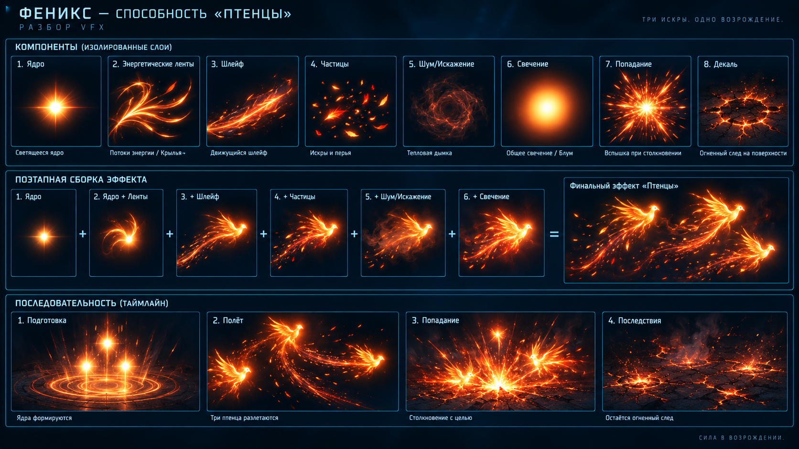

# Ability sandbox — VFX breakdown

Этот отчёт описывает общий визуальный стандарт для всех 26 способностей песочницы. Runtime-реализация находится в `Assets/Scripts/SandboxLayeredVfx.cs`; он использует фиксированные пулы `LineRenderer` и `SpriteRenderer`, поэтому способности не создают новые GameObject в каждом кадре.

## VFX breakdown

`Background — назначение / стоимость / реализация / low settings.`

Большое кольцо вокруг арены задаёт глубину и масштаб действия. Стоимость низкая: несколько прозрачных сегментов и умеренный overdraw. Реализация — `Ring` в `SandboxLayeredVfx.RenderBackground`. На low settings фон полностью отключается; игровая геометрия и телеграф остаются.

`Parallax layers — назначение / стоимость / реализация / low settings.`

Две медленно вращающиеся дуги дают ощущение движения космоса и отделяют эффект от неподвижного фона. Стоимость низкая/средняя из-за прозрачности и дополнительных `LineRenderer`. Реализация — две `Arc` с разными фазами и скоростями. На low settings отключаются обе дуги.

`Midground — назначение / стоимость / реализация / low settings.`

Форма способности читается как отдельная геометрия: кольца, алмаз, шевроны, разрыв курса, волна или орбитальная ловушка. Стоимость средняя: профиль использует ограниченное число линий. Реализация — `RenderAbility` и профиль по `AbilitySandboxAbilityId`. На low settings сохраняется основной профиль и его размер/направление.

`Gameplay layer — назначение / стоимость / реализация / low settings.`

Ядро и целевая точка показывают источник, направление и безопасную демонстрационную финальную точку. Стоимость низкая: два `SpriteRenderer` из пула. Реализация — `Sprite(abilityCore, ...)` и телеграфная линия. На low settings этот слой никогда не отключается.

`Lighting — назначение / стоимость / реализация / low settings.`

Мягкие ореолы отделяют ядро от тёмного космоса и подчёркивают силу импульса. Стоимость средняя из-за fill-rate прозрачных спрайтов. Реализация — два `Halo` на `Sprites/Default`. На low settings ореолы отключаются.

`Character/ship VFX — назначение / стоимость / реализация / low settings.`

Пассивные способности постоянно маркируют босса и корабль: солнечный венец, aegis-кольцо, resonator-дуга, ember-ядро, kinetic-орбиты и ghost-бейдж. Стоимость низкая/средняя, зависит от числа дуг. Реализация — `RenderPassives`. На low settings остаётся один компактный игровой маркер вместо декоративных дуг.

`Particles — назначение / стоимость / реализация / low settings.`

Микроосколки, искры и руны показывают фазу и направление, а не заменяют силуэт. Стоимость средняя/высокая из-за количества сегментов и overdraw. Реализация — `Diamond`, `Chevron` и pooled line geometry. На low settings вторичные частицы и debris отключаются.

`Foreground — назначение / стоимость / реализация / low settings.`

Короткий светлый контур перед кораблём сохраняет читаемость эффекта поверх gameplay-слоя. Стоимость низкая: одна короткая дуга. Реализация — foreground `Arc` с sorting order 18. На low settings отключается.

`Post-processing — назначение / стоимость / реализация / low settings.`

Большой слабый цветовой ореол связывает способность со сценой и создаёт ощущение импульса без дорогого full-screen stack. Стоимость средняя из-за fill-rate. Реализация — bounded `Halo` вокруг центра арены. На low settings отключается полностью.

## Shot breakdown

`anticipation/muzzle flash — назначение: предупредить о запуске; стоимость: низкая; реализация: кольцо и белое ядро в первые 0.12 с; low settings: сохраняется.`

`projectile core — назначение: сохранить узнаваемый силуэт спелла; стоимость: низкая; реализация: pooled `SpriteRenderer` с профильной иконкой/спрайтом; low settings: сохраняется.`

`trail/ribbon — назначение: показать реальное направление и скорость; стоимость: средняя; реализация: 18-точечный волнистый `LineRenderer`, привязанный к velocity; low settings: сохраняется в упрощённом виде.`

`secondary particles — назначение: добавить вариативность и материал энергии; стоимость: средняя; реализация: три движущихся `Diamond` вдоль траектории; low settings: отключаются.`

`impact flash — назначение: обозначить безопасную демонстрационную конечную точку; стоимость: низкая/средняя; реализация: два затухающих кольца после `FlightTime`; low settings: сохраняется.`

`debris/sparks — назначение: усилить ощущение удара; стоимость: средняя; реализация: пять направленных линий-искр; low settings: отключаются.`

`short aftermath — назначение: подтвердить завершение действия; стоимость: низкая; реализация: короткая затухающая дуга 0.34 с; low settings: сохраняется.`

## Phoenix Solar Chicks — пример сборки по гайду

Для способности «Птенцы» итоговый снаряд собирается из восьми независимых слоёв и затем проигрывается как один pooled shot:

1. **Core** — спрайт птенца с белым горячим центром; масштаб пульсирует.
2. **Energy Ribbons** — две вращающиеся дуги, имитирующие крылья и раскалённые перья.
3. **Trail** — основной ribbon за снарядом и три ветвящихся feather-филамента, зависящие от velocity.
4. **Particles** — четыре золотых/красных ember-осколка вдоль следа; у каждого своя фаза и альфа.
5. **Noise / Distortion** — прерывистое дыхающее heat-кольцо как дешёвый proxy distortion.
6. **Glow / Bloom** — два halo-слоя вокруг ядра; на low settings отключаются, core остаётся.
7. **Impact** — белая радиальная вспышка и шесть искр в безопасной демонстрационной точке.
8. **Decal** — короткая огненная руна под финальной точкой, затухающая вместе с aftermath.

Таймлайн одного птенца: `0.00–0.12` — anticipation и сборка ядра; `0.12–FlightTime` — полёт, ribbons, ветвящийся trail и частицы; `FlightTime–FlightTime+0.34` — impact, sparks, decal и aftermath. Три птенца используют один и тот же профиль, но получают разные `Seed`, поэтому крылья, ветви и частицы не синхронизированы.

Сборка и анимация находятся в двух общих runtime-точках: `SandboxLayeredVfx.RenderPhoenixChickLayers` для песочницы и `Projectile.SetFirebirdChickVisual` / `Projectile.UpdateFirebirdChickBranches` для обычного игрового маршрута. `BeginAbility(SolarChicks)` задаёт профиль, `EmitShot` добавляет три shot-экземпляра в пул, а `Tick` обновляет восемь слоёв по времени. В обычной игре каждый pooled projectile теперь также получает крыльевые ribbons, heat-ring, glow, искры и три ветви trail; `GameManager.RemoveProjectile` добавляет отдельный impact burst перед возвратом снаряда в пул. Общий seven-phase shot lifecycle остаётся активным поверх этой профильной сборки.

## Визуальные доказательства сборки — Solar Chicks

Ниже сохранён компонентный лист по тому же принципу, что и референс пользователя: каждый слой показан отдельно, затем добавляется по шагам до финального composite, а внизу показаны четыре стадии жизни эффекта.

Это production-reference sheet для проверки состава и силуэта, а не подмена кадрами из Play Mode. Панели на листе соответствуют обязательным evidence-идентификаторам:

| Evidence ID | Что должно быть видно | Панель на листе |
|---|---|---|
| `01-core` | бело-горячее ядро птенца | 1. Ядро |
| `02-energy-ribbons` | две вращающиеся перьевые ленты | 2. Энергетические ленты |
| `03-trail` | основной шлейф и ветви | 3. Шлейф |
| `04-particles` | искры и перья | 4. Частицы |
| `05-noise-distortion` | дыхающее тепловое кольцо | 5. Шум/Искажение |
| `06-glow-bloom` | два ореола свечения | 6. Свечение |
| `07-impact` | радиальная вспышка и искры | 7. Попадание |
| `08-decal` | огненный след-руна | 8. Декаль |
| `final-composite` | три разлетающихся птенца с ветвящимися следами | Финальный эффект «Птенцы» |

Для фактической Unity-проверки кадры должны быть сохранены с теми же именами в `Temp/SandboxMechanicsEvidence/SolarChicks/`: отдельные слои, последовательные сборки `core → core+ribbons → +trail → +particles → +noise → +glow`, затем `final-composite`, а также `anticipation`, `flight`, `impact`, `aftermath`. В отчёте эти кадры прикладываются рядом с листом; если захват недоступен, это явно помечается как `concept/reference`, а не как подтверждение Play Mode.

## Профили способностей

| Группа | Способности | Визуальная форма и телеграф |
|---|---|---|
| Phoenix active | SolarChicks, AshenEgg, PhoenixDive | веер птенцов, раскалённое яйцо, радиальный dive-импульс |
| Phoenix passive | SolarPlume, EmberCore | крыльевой венец и пульсирующее ember-ядро вокруг босса |
| Harrier active | HarrierRiftCopies, HarrierPhaseDash, HarrierColdFan | копии на орбите, разрыв траектории, холодные шард-веера |
| Void active | VoidRiftBeam, VoidGravityRoots, VoidBarrage, BlackHole | луч, корни, void-веер и чёрная дыра с воронкой |
| Pilot active | RiftEcho, VectorSnap, OrbitAnchor, TrajectoryReplay, DelayedShot, CourseRupture, GravityWave, MineRing, Polarity | эхо, snap-импульс, якорь, replay-дуга, задержанный залп, разворот курса, волна, минное кольцо и противоположные полюса |
| Pilot passive | AegisOrbit, EchoResonator, KineticOverdrive, GhostTrail, Gigantism | защитная орбита, резонансный алмаз, kinetic-дуги, призрачный след и увеличенный силуэт корабля |

`Проверка: телеграф / активная фаза / финал / UI / очистка пулов.`

Точка входа способности вызывает `BeginAbility`, каждый снаряд вызывает `EmitShot`, а каждый кадр песочницы вызывает `Tick`. `Hide` очищает активные shots и отключает pooled root. `AbilitySandboxValidation` проверяет существование директора, полный shot phase mask на обычном качестве, ограничение пулов, выход в меню и регрессию окна паузы.
